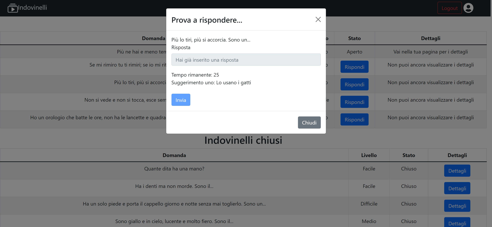

# Exam #2: "Indovinelli"
## Student: s301793 DI GANGI FRANCESCO 

## React Client Application Routes

- Route `/`: homepage of the web-application
- Route `/homepageloggedin`: homepage for who is logged-in, has 3 choices: Insert a new riddle, See all riddles, See your riddles
- Route `/inseriscinuovoindovinello`: page to insert a new riddle
- Route `/visualizzatuttigliindovinelli`: page with all the riddles for a logged user
- Route `/visualizzaAnonimo`: page with all the riddles for a non logged user
- Route `/visualizzatuoiindovinelli`: page with the riddles of the current logged user
- Route `/login`: page to log in.

## API Server

### GET Methods

- GET `/api/getIndovinelli`
  - Returns all the riddles
  - Request body: empty
  - Request response: `200 OK` (success); body: An array of objects, each describing id, domanda, livello, durata, risposta_corretta, suggerimentoUno, suggerimentoDue, id_utente, stato
  - Response body
  ```
  [
    {
      "id":1,
      "domanda":"Quante dita ha una mano?",
      "livello": "Facile",
      "durata": 30,
      "risposta_corretta": "cinque",
      "suggerimentoUno": "Guarda la tua mano",
      "suggerimentoDue": "Aggiungi tre a due",
      "id_utente": 1,
      "stato": 0
    }
  ]
  ```

- GET `/api/getIndovinelliApertiConRisposta`
  - Returns all the riddles that have at leats a response
  - Request body: empty
  - Request response: `200 OK` (success); body: An array of objects, each describing id, domanda, livello, durata, risposta_corretta, suggerimentoUno, suggerimentoDue, id_utente, stato, risposta, corretta, timestamp, temporimasto
  - Response body
  ```
  [
    {
        "id":1,
				"domanda":"Quante dita ha una mano?",
				"livello":"Facile",
				"durata":30,
				"risposta_corretta":"cinque",
        "suggerimentoUno": "Guarda la tua mano",
        "suggerimentoDue": "Aggiungi tre a due",
				"id_utente":1,
				"stato":1,
				"risposta":"quattro",
				"corretta":0,
				"timestamp":"1657039269589",
				"tempoRimasto":null
    }
  ]
  ```

- GET `/api/getIndovinelliUtente/:id`
  - Returns all the riddles of a user
  - Request body: empty
  - Request header : has a line `Content-Type: application/json `and req.params.id to retrieve the user's riddles
  - Request response: `200 OK` (success); body: An array of objects, each describing id, domanda, livello, durata, risposta_corretta, suggerimentoUno, suggerimentoDue, id_utente, stato
  - Response body
  ```
  [
    {
      "id":1,
      "domanda":"Quante dita ha una mano?",
      "livello": "Facile",
      "durata": 30,
      "risposta_corretta": "cinque",
      "suggerimentoUno": "Guarda la tua mano",
      "suggerimentoDue": "Aggiungi tre a due",
      "id_utente": 1,
      "stato": 0
    }
    ...
  ]
  ```

- GET `/api/getRisposteIndovinello/`
  - Returns all the riddles of a user
  - Request body: empty
  - Request response: `200 OK` (success); body: An array of objects, each describing id_indovinello, id_utente, risposta, corretta, timestamp
  - Response body
  ```
  [
    {
      "id_indovinello":1,
      "id_utente":2,
      "risposta": "Cinque",
      "corretta": 0,
      "timestamp": "1657039269589",
    }
    ...
  ]
  ```

- GET `/api/getRisposteIndovinelloAperto/:id`
  - Returns all the riddles of a user
  - Request body: empty
  - Request header : has a line `Content-Type: application/json `and req.params.id to retrieves the answers of a riddle
  - Request response: `200 OK` (success); body: An array of objects, each describing id_indovinello, id_utente, risposta, corretta, timestamp
  - Response body
  ```
  [
    {
      "id_indovinello":1,
      "id_utente":2,
      "risposta": "Cinque",
      "corretta": 0,
      "timestamp": "1657039269589",
    }
    ...
  ]
  ```

- GET `/api/getClassifica/`
  - Returns a rank of users
  - Request body: empty
  - Request response: `200 OK` (success); body: An array of objects, each describing username, punteggio
  - Response body
  ```
  [
    {
      "username": "testuser@polito.it",
      "punteggio": 3
    }
    ...
  ]
  ```

- GET `/api/getPunteggioUtente/:id`
  - Returns all the riddles of a user
  - Request body: empty
  - Request header : has a line `Content-Type: application/json `and req.params.id to retrieves the score of a user
  - Request response: `200 OK` (success); body: punteggio of a user
  - Response body
  ```
  [
    {
      "punteggio": 5
    }
    ...
  ]
  ```
### PUT Methods

- PUT `/api/aggiornaPunteggio/:id/:punteggio`
  - Update the current score of a user
  - Request header has a line: `Content-Type: application/json` and req.params.puntegghio to retrieve the new value and req.params.id to retrieve the user's id
  - Request body: 
  ```
  [
    {
      "id":1,
      "punteggio":3
    }
  ]
  ```
  - Response header: 200 OK (success);
  - Response body: empty.
  - Error responses: `401 Unauthorized` (not logged in or wrong permissions),` 404 Not Found` (no id found)

- PUT `/api/chiudiIndovinello`
  - Close an open riddle
  - Request header has a line: `Content-Type: application/json`
  - Request body: 
  ```
  [
    {
      "id":1
    }
  ]
  ```
  - Response header: 200 OK (success);
  - Response body: empty.
  - Error responses: `401 Unauthorized` (not logged in or wrong permissions),` 404 Not Found` (no id found)

### POST Methods

- POST `/api/sessions`
  - Authenticate a user
  - Request header has a line: `Content-Type: application/json`
  - Request body:
  ```
  [
    {
      "username":"testuser@polito.it",
      "password": "password"
    }
  ]
  ```
  - Response header: `201 created` (success); body: an object describing the message
  - Error responses: `404 Not found` (no user in db), `500 Generic Error`

- POST `/api/inserisciIndovinello`
  - Insert a new riddle
  - Request header has a line: `Content-Type: application/json`
  - Request body:
  ```
  [
    {
      "domanda":"Quante dita ha una mano?",
      "livello":"Facile",
      "durata": 30,
      "suggerimentoUno": "guarda la tua",
      "suggerimentoDue": "3+2",
      "id_utente": 1,
      "stato": "Aperto"
    }
  ]
  ```
  - Response header: `201 created` (success); body: an object describing the message
  - Responde body: empty
  - Error responses: `401 Unauthorized` (not logged in or wrong permissions), `500 Generic Error`

- POST `/api/inserisciRisposta`
  - Insert a new response
  - Request header has a line: `Content-Type: application/json`
  - Request body:
  ```
  [
    {
      "id_indovinello": 1,
      "id_utente": 3,
      "risposta": "venti",
      "corretta": 0
    }
  ]
  ```
### DELETE Methods

- DELETE `/api/sessions/current`
  - Delete the session for the current user
  - Request header: none
  - Request body: none
  - Response header: `204 No Content` (success)
  - Responde body: empty
  - - Error responses: `401 Unauthorized` (not logged in or wrong permissions), `500 Generic Error`

## Database Tables

- Table `indovinelli` - contains id (pk), domanda, livello, durata, risposta_corretta, suggerimentoUno, suggerimentoDue, id_utente, stato
- Table `risposte` - contains id_indovinello, id_utente, risposta, corretta, timestamp; pk: (id_indovinello,id_utente)
- Table `utenti` - contains id (pk), username, password, salt, punteggio

## Main React Components

- `MyNavbar` and `Outlet` (in `Layout.js`): allows me to have always the navbar on top and to have a child over
- `Router` (in `App.js`): supplies routing information to the rest of the app
- `Route` (in `App.js`): renders in React Router based the current location
- `Routes` (in `App.js`): renders all the Route(s)
- `Navigate` (in `App.js`): changes the location when it is rendered, in my case useful for the login phase
- Modal(s) (in `VisualizzaITuoiIndovinelli.js`, `VisualizzaTuttiGliIndovinelli.js`): to show details of a riddle or to answer to a riddle
- `InserisciIndovinello` (in `InserisciIndovinello.js`): allows a user to insert a new riddle to the database
- `Classifica` (in `Classifica.js`): contains a rank of users' scores
- `useState`: used to update several states in the application

## Screenshot



## Users Credentials

- testuser@polito.it, password
- testuser2@polito.it, password
- testuser3@polito.it, password
- testuser4@polito.it, password
- testuser5@polito.it, password
